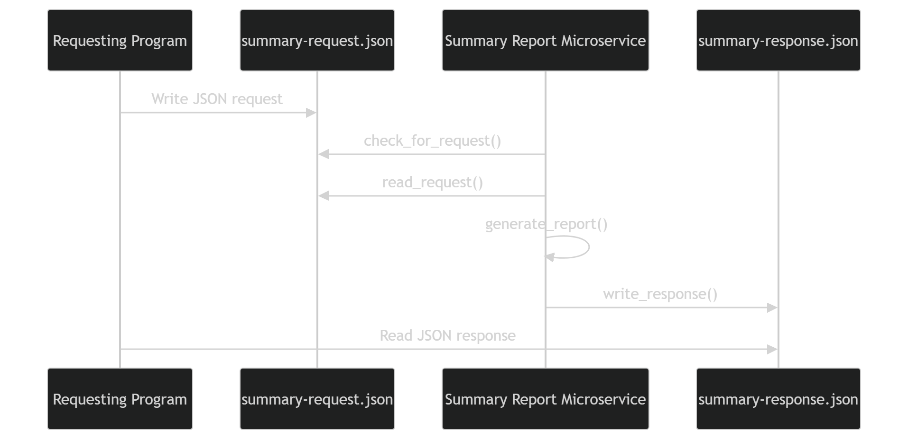

# Summary Report Generator Microservice

## Description

This microservice generates summary reports for task or workout data.

It can create:
- Completion summaries
- Category summaries
- Priority summaries

The microservice uses JSON files for communication.

Request file:

```text
summary-request.json
```

Response file:

```text
summary-response.json
```

---

## How to Request Data

To request data, another program must create `summary-request.json`.

The request must include:
- `report_type`
- `data_type`
- `items`

Supported `report_type` values:
- `completion_summary`
- `category_summary`
- `priority_summary`

### Example Request Call

```python
import json

request_data = {
    "report_type": "completion_summary",
    "data_type": "tasks",
    "items": [
        {
            "title": "Finish homework",
            "priority": "High",
            "category": "School",
            "completed": True
        },
        {
            "title": "Clean room",
            "priority": "Low",
            "category": "Personal",
            "completed": False
        }
    ]
}

with open("summary-request.json", "w") as file:
    json.dump(request_data, file, indent=4)
```

---

## How to Receive Data

After the microservice processes the request, it creates `summary-response.json`.

The requesting program should wait for this file, read it, and then remove it.

### Example Receive Call

```python
import json
import os
import time

while not os.path.exists("summary-response.json"):
    time.sleep(0.5)

with open("summary-response.json", "r") as file:
    response_data = json.load(file)

print(response_data)

os.remove("summary-response.json")
```

---

## Example Response

```json
{
    "status": "success",
    "report_type": "completion_summary",
    "data_type": "tasks",
    "total_items": 2,
    "completed_items": 1,
    "incomplete_items": 1
}
```

---

## UML Sequence Diagram


